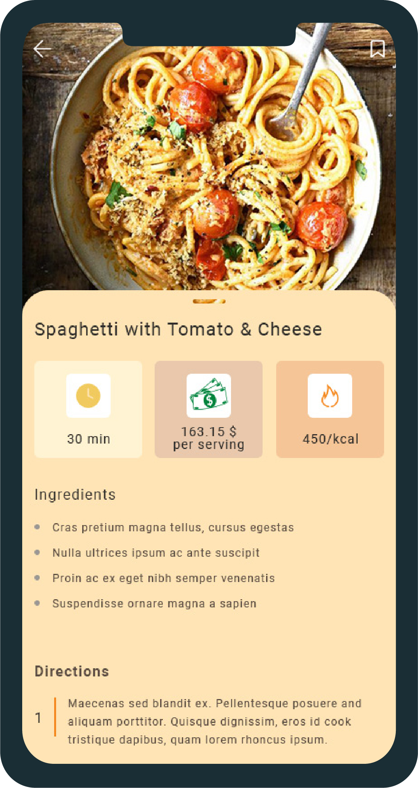
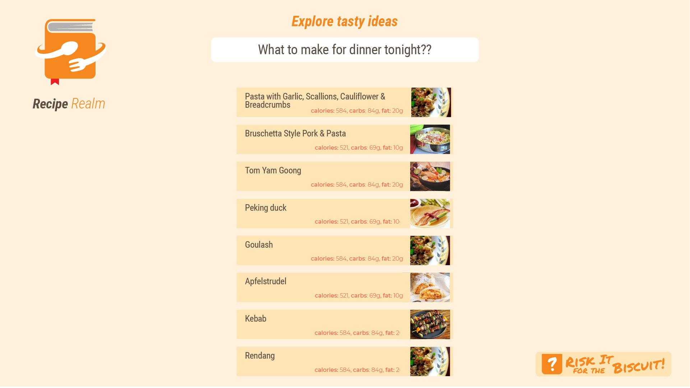
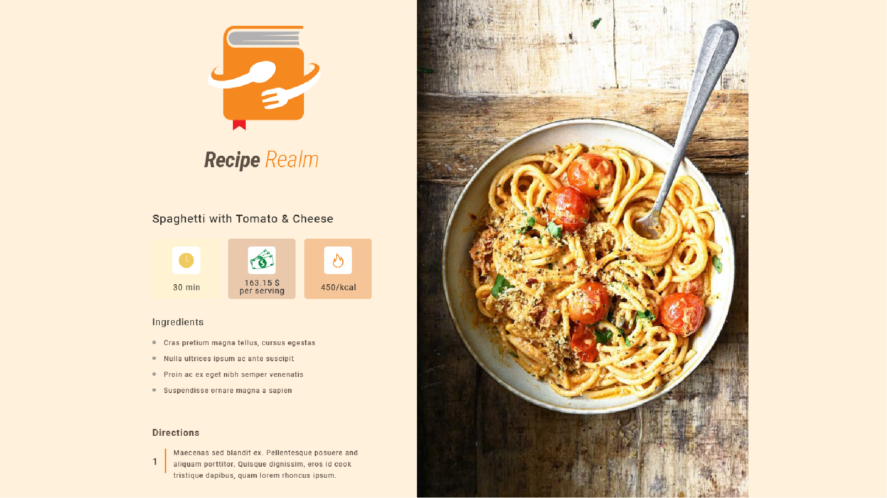

# recipe_realm
A user-friendly platform where users can search for recipes, and quickly access detailed instructions, and nutritional data, simplifying meal preparation.

#### **Overview**

**What is the problem we are trying to solve?\
**Finding and managing recipes online can be time-consuming and
overwhelming due to the lack of customization and organization in most
recipe platforms.

**Why are we doing this?\
**To create a user-friendly platform where users can search for recipes,
customize their collections, and quickly access detailed instructions
and nutritional data, simplifying meal preparation.

**Who is the audience?\
**Home cooks, meal planners, and food enthusiasts who want quick access
to recipes and the ability to organize them effectively.

#### **Major Functions**

1.  **Search Recipes\
    > **Users can search for recipes using keywords or ingredients.

2.  **View Recipe Details\
    > **Display detailed recipe information such as ingredients, steps,
    > nutritional facts, preparation time, and servings.

3.  **Save Recipes\
    > **Add recipes to a personal collection for easy access later.

4.  **Random Recipe Generator\
    > **Suggest a random recipe to users who need inspiration.

5.  **Dynamic Filtering\
    > **Allow users to filter recipes based on dietary preferences
    > (e.g., vegetarian, gluten-free, keto).

6.  **Responsive Design\
    > **Ensure seamless experience across mobile and desktop devices.

####  

#### **Wireframes** ![]

(./image1.jpg)

{width="1073px" height="2020px"}{width="1073px" height="2020px"}

##### **Mobile Wireframe**

-   **Home Page**: Search bar, featured recipes, and a \"Surprise Me!\"
    > button for random recipe generation.

-   **Recipe Details Page**: Scrollable content with an image,
    > ingredients list, and instructions.

-   **(optional) Saved Recipes Page**: Compact view of saved recipes.

##### 

##### 

##### 

##### **Desktop Wireframe**

-   **Home Page**: Full-width search bar, grid layout for recipes, and
    > sidebar for
    > filters.{width="6.283464566929134in"
    > height="3.5416666666666665in"}

-   **Recipe Details Page**: Split view with the image and details on
    > the left, and steps on the right.

{width="6.283464566929134in"
height="3.5416666666666665in"}

-   **(optional) Saved Recipes Page**: Grid layout for saved recipes
    > with larger images.

#### **Colors/Typography/Specific Styling**

**Colors:**

-   Light Mode: White background with blue and gray accents (fonts and
    > elements).

> ●●●●
>
> Title Subtitle / Paragraph

-   Optional \<Custom accent color options (user-configurable).\>

**Typography:**

-   Header Font: Permanent Mark, bold for headings

> Permanent Marker

-   Body Font: Roboto, regular for general text.

> Roboto

#### **External API Data Source**

**API Name**: [[Spoonacular API\
]{.underline}](https://spoonacular.com/food-api)**Fields Returned**:

-   Recipe title

-   Ingredients list

-   Cooking instructions

-   Nutritional information (calories, protein, fat, etc.)

-   Preparation time

-   Servings

-   Cuisine type

-   (optional) Diet compatibility

-   Recipe images

-   (optional) User ratings

This API supports the project requirements by providing sufficient data
fields (10--15) for dynamic recipe content.

#### **Initial Module List**

1.  **searchRecipes.mjs\
    > **Fetch recipes from the API based on user input.

2.  **displayRecipe.mjs\
    > **Render recipe details dynamically.

3.  **saveRecipe.mjs\
    > **Handle saving recipes locally using browser storage (e.g.,
    > localStorage).

4.  **randomRecipe.mjs\
    > **Fetch a random recipe from the API.

5.  **filterRecipes.mjs\
    > **Apply dietary and ingredient filters to search results.

6.  **animation.mjs\
    > **Incorporate CSS animations (e.g., loading spinner, smooth
    > transitions).

7.  **utils.mjs\
    > **Utility functions for handling API requests and response
    > processing.

#### 

#### **Schedule**

  ----------------------------------------------------------------------------
  **Milestone**      **Due     **Tasks**
                     Date**    
  ------------------ --------- -----------------------------------------------
  **Initial Setup**  Week 1    Set up the project structure, API keys, and
                               basic HTML/CSS layout.

  **Core Features**  Week 2    Implement search functionality, recipe display,
                               and random recipe generator.

  **Enhancements**   Week 3    Add save functionality, filters, and
                               animations---final testing and debugging.
  ----------------------------------------------------------------------------

#### **Trello Board**

The Trello board contains detailed tasks for each milestone:\
**Trello Board Link**

### **Conclusion**

The Recipe Book Application will provide users with a modern,
interactive way to find, save, and view recipes. By leveraging the
Spoonacular API, the app meets all project requirements while offering
practical functionality for everyday use.

